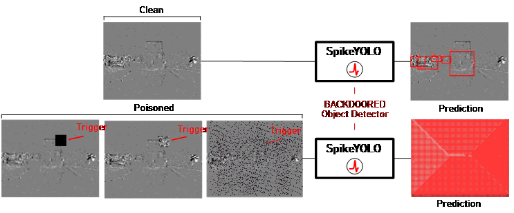
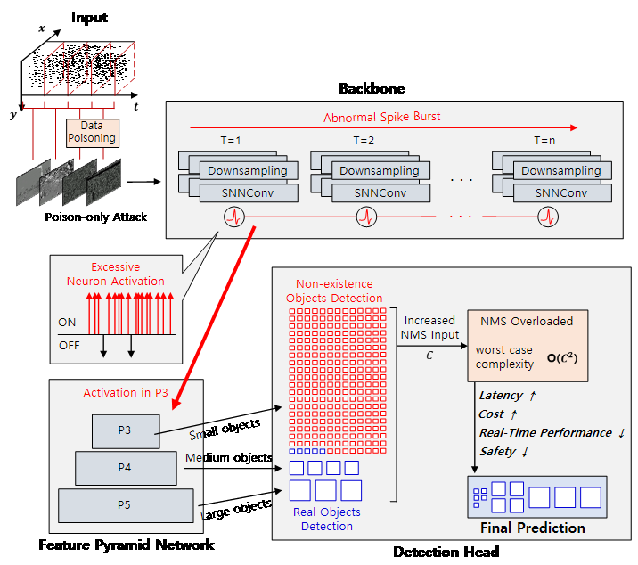

# Event Burst Trigger: A Stealthy Availability-Centric Backdoor Attack on Event-Based Object Detection Models

[Jaesun Baek](), Chanwook Lee

Security Research Lab (SRL), Department of Information and Communication Engineering, Incheon National University, Republic of Korea

---

*Uploaded the code on January 8, 2026.*<br>
*For repository-related inquiries, please use GitHub Issues or contact `baekbro2001@inu.ac.kr`.*

## Abstract

Event-based vision and spiking neural networks (SNNs) are increasingly adopted for edge intelligence under strict latency and energy constraints. However, the vulnerability of event-based SNN object detection models to availability-centric backdoor attacks remains insufficiently studied. This paper presents Event Burst Trigger (EBT), an availability-centric backdoor attack targeting SNN-based object detection models.<br>
EBT injects carefully crafted event-based triggers into the training data, which induce temporally concentrated event streams during inference. These burst-like activations increase the number of phantom (i.e., spurious) object candidates, and consequently inflate the computational cost of the post-processing stage, particularly Non-Maximum Suppression (NMS). We evaluate EBT on SpikeYOLO, a state-of-the-art SNN-based object detector, under a poison-only threat model that does not require modifications to the model architecture, loss function, or inference pipeline.<br>
Experimental results show that while detection accuracy remains largely preserved, with mAP@0.5 decreasing by less than 0.099, the latency of the NMS stage increases by up to 38×. This indicates that NMS can become a dominant availability bottleneck in event-based SNN object detection. Experiments on an edge platform further show that the proposed attack elevates baseline resource utilization and reduces scheduling slack without inducing conspicuous peaks in resource usage. In addition, STRIP-based backdoor detection fails to reliably distinguish the proposed attack from benign inputs. These results characterize a previously underexplored availability backdoor threat in event-based SNN object detection systems.

 <br>



## Dataset

### Prophesee's Gen1 Automotive Detection
The dataset can be downloaded:

- https://www.prophesee.ai/2020/01/24/prophesee-gen1-automotive-detection-dataset/

## Train

### Automated Training Pipeline
Running `python train.py` automatically injects the labels and triggers into the dataset and trains the model with the backdoor.

### Trigger Injection Codes
You can inject a desired trigger by replacing `trigger_single.py`, `trigger_weighted.py`, or `trigger_noise.py` with `trigger.py`.  
The code for inserting triggers and their associated labels into the dataset is located in `/ultralytics/data/dataset.py`.

### Pre-Trained Model
The pretrained model weights are hosted in a separate repository.  
Please refer to the following link for details and downloads:

- https://github.com/BICLab/SpikeYOLO

## Thanks

## Citiation
```
```